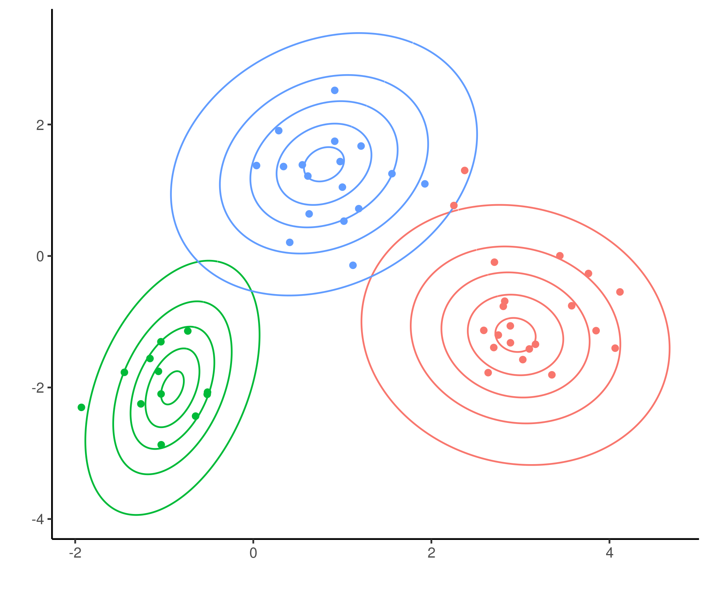

# mixtureModels

Here we provide efficient Rcpp implementation for fitting Bayesian non-parametric mixture models. Specifically, we provide MCMC-based inference for

* Dirichlet Process mixture (DPM)
* Mixture of Finite mixtures (MFM) [(Miller and Harrison, 2017)](https://www.tandfonline.com/doi/abs/10.1080/01621459.2016.1255636)

for the case where mixture components are assumed to follow a Normal-Inverse-Wishart distribution. 

We have implemented two MCMC moves:

* The collapsed Gibbs sampler
* The Sequentially Allocated Split-Merge sampler (Dahl 2003)

Our implementation exposes the C++ classes to R via Rcpp modules. All MCMC updates utilise the rank-one updates for the Cholesky decomposition. 

Example usage:

```
library(mixtureModels)

set.seed(1)
N <- 50
mu_list <- list(c(-1, -2), c(1, 1), c(3, -1))
Sigma_list <- list(0.4*diag(2), 0.4*diag(2), 0.4*diag(2))
data <- generate_from_2D_GMM(N, mu_list, Sigma_list)

X <- data$X
n_iter <- 20
plot_freq <- 5
# initialise cluster allocations
z <- rep(1, N)
# initialise mixture model object
m <- mixture(X, z, type = "DPM")
# do MCMC sampling
for(i in 1:100){
  m$collapsed_gibbs()
  m$split_merge()
}
plot_2D_GMM(m)
```



For another demonstration see this [toy example](https://htmlpreview.github.io/?https://raw.githubusercontent.com/kasparmartens/mixtureModels/master/examples/clustering_toy.html). 
